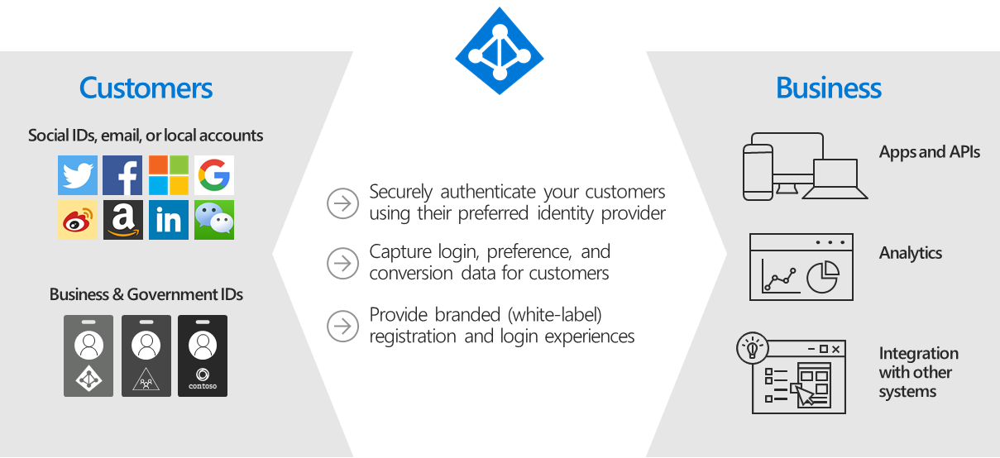

# Blazor Azure B2C Authentication and Authorization

## Technologies Used

1. Blazor, 
1. Azure B2C, 
1. .NET 6.0

## Authentication and Authorization


## What is Azure Active Directory B2C?

Azure Active Directory B2C provides business-to-customer identity as a service. Your customers use their preferred social, enterprise, or local account identities to get single sign-on access to your applications and APIs.



Azure B2c flow


## Set-Up An Azure Active Directory B2C Tenant
Creating an **Azure Active Directory B2C Tenant** requires an Azure Account.

Sign in to the **Azure Portal** using an existing account at: https://portal.azure.com/ or sign-up for a new one at: https://azure.microsoft.com/en-us/free/.

> **Note**: An Azure account that's been assigned at least the Contributor role within the Azure subscription or a resource group within the subscription is required.

Follow the directions here: Tutorial - Create an Azure Active Directory B2C tenant | Microsoft Docs

In the **Azure Portal**, click Create a resource and search for **Azure Active Directory B2C** and press **enter**.


Click **Create**


Click **Create a new Azure AD B2C Tenant**.


Fill out the form and click **Review + Create**.


After the **Azure B2C Tenant** is set up, search for it and select it using the **All resources**.


This will direct you to a screen that will display a link to allow you to navigate to the **tenant**.


## Register A Web Application

To allow the application, to interact with Azure Active Directory B2C Tenant it must be registered.
Select **App Registrations**, then **New registration**.


Give the application a **Name**, Select **Accounts in any identity provider or organizational directory**, also **Grant admin consent to openid and offline_access permissions**, and click Register.

The **App Registration** will be created.


## Configure Azure B2C Application Identity Provider & User Flow

In the **Azure B2C Tenant**, click **User flows** then select **New user flow**.


Select **Sign up and sign In**.


Select **Recommended** for the **Version** and click **Create**.


Give the **Flow** a name and select **None** for **Local accounts** and **Microsoft Account** for **Social Identity providers**.


Select options for Multifactor authentication.


For **User attributes and token claims**, select **Show more…**


Select the options in the image below.

Click **Ok**. Click **Create**


The **Flow** will show in the **User flows** section.


## Create The Blazor Server Azure B2C Application

Using Visual Studio 2022 **Create a new project**.


Select **Blazor Server App**.


Name the project **BlazorAzureB2C** and click **Next**.


Select **.Net 6.0, Microsoft identity platform**, Configure for **HTTPS**, and click **Create**.


When the **Required components** box pop up, click the **Finish** button.


## Add the Redirect URI in the Azure App Registration

In the **Solution Explorer**, open the **launchSettings.json** file in the **Properties** folder.


Copy the **applicationUrl** in the **Profiles** section, that begins with **https**.


In the **Azure Portal**, search for the **App registration** created earlier and select it.


Select **Add a Redirect URI**.


Select **Add a platform**.


Select **Web**.


Enter the **URL** of the **Blazor** application (copied earlier), with **/signin-oidc** at the end.

Check the **Access** and **ID tokens** boxes, and click the **Configure** button.

> **Note**: When you deploy the application to a **production** website, you will need to add the **URI** of that address to this page.


Update the appsettings.json File


In **Visual Studio**, in the **Solution Explorer**, open the **Appsettings.json** file.

Replace all the contents with the following:

```
{
  /*
The following identity settings need to be configured
before the project can be successfully executed.
For more info see https://aka.ms/dotnet-template-ms-identity-platform 
*/
  "AzureAd": {
    "Instance": "https://{Your Azure B2C Domain Name}.b2clogin.com/tfp/",
    "ClientId": "{Your Application (client) ID}",
    "CallbackPath": "/signin-oidc",
    "Domain": "{Your Azure B2C Domain Name}.onmicrosoft.com",
    "SignUpSignInPolicyId": "{Your Signup policy}",
    "ResetPasswordPolicyId": "",
    "EditProfilePolicyId": ""
  },
  "Logging": {
    "LogLevel": {
      "Default": "Information",
      "Microsoft.AspNetCore": "Warning"
    }
  },
  "AllowedHosts": "*"
}

```